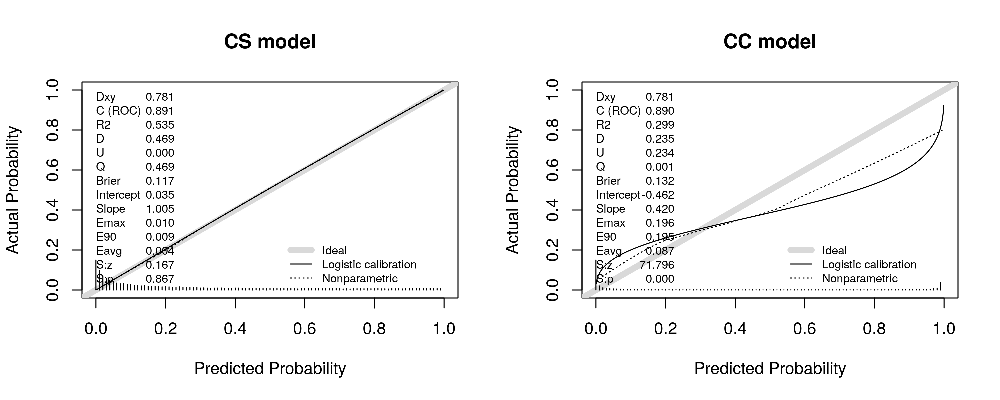
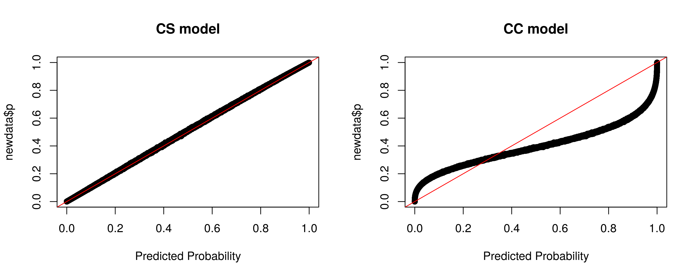
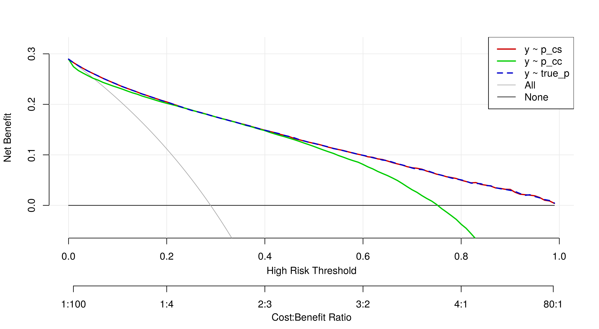
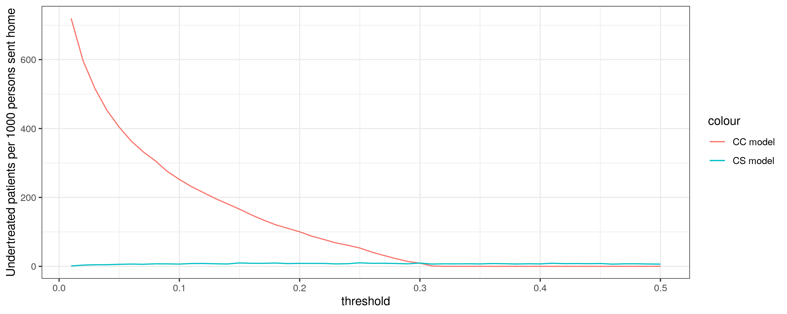

# Simulating study design effect on diagnostic models

* Compare cross-sectional (CS) vs case-control (CC) designs for diagnostic model development and validation (internal and external)

# Load packages


```r
library(tidyverse)
library(ggpubr)
library(patchwork)
library(runway)
library(rms)
library(rmda)
theme_set(theme_bw())
source("R/functions.R")  # load helper functions
```

# Simulating the population

* population of 1M individuals. 
* for each individual, we simulate continuous traits (eg blood biomarkers) using multivariate normal distribution, fix a set of (logistic) regression coefficients, and then use their linear combination to define the their true underlying probability of a binary outcome (e.g. having cancer).
* given the true probabilities, we then simulate the outcome itself.


```r
SEED <- 123456
n_pop <- 1e6
X <- get_X(
  n = n_pop,
  v = 2,                  # common variance
  corr = c(-0.2, 0, 0),   # correlations x1-x2, x1-x3, x2-x3
  mu = c(0, 0, 0),        # all centered
  .seed = SEED
)

beta <- c(-1.6, log(1.2), log(.3), log(3))
p <- plogis(X %*% beta)
y <- rbinom(n = n_pop, size = 1, prob = p)
df_pop <- data.frame(
  patient_id = paste0("patient-", 1:n_pop),
  y = y,
  p = p, 
  x1 = X[, 2],
  x2 = X[, 3],
  x3 = X[, 4]
)
head(df_pop)
```

```
##   patient_id y           p         x1         x2         x3
## 1  patient-1 1 0.569076442 -0.7526996  1.0739182  3.0113315
## 2  patient-2 0 0.028950911  1.2866018  0.6818114 -1.2074034
## 3  patient-3 1 0.833946085 -0.1814995 -0.9592696  1.9042323
## 4  patient-4 0 0.123629566 -0.1494707  0.0422046 -0.2552622
## 5  patient-5 0 0.005517657 -1.3382222  3.5962228  0.8915541
## 6  patient-6 0 0.026553208 -0.6837702  1.1444403 -0.4543473
```

Prevalence of disease (or the average underlying probability) is about 30%.


```r
df_pop %>% 
  summarise(mean(y), mean(p))
```

```
##    mean(y)  mean(p)
## 1 0.292072 0.292702
```

The coefficient vector implies that `x1` and `x2` have moderate predictor effects, while `x3` is just noise.


```r
group_differences(df_pop)
```

```
## # A tibble: 1 × 3
##   x1_diff x2_diff x3_diff
##     <dbl>   <dbl>   <dbl>
## 1   0.477   -1.41    1.24
```

* distribution of disease probabilities. 
* maximum possible discrimination in this setting (how well the cases and controls are separated by their corresponding disease probabilities)


```r
.title <- paste0(
  "max AUC ", get_auc(df_pop$y, df_pop$p)
)
plot_disease_prob(df_pop[sample(1:n_pop, 2e4),], title = .title)
```

<!-- -->

# Simulating a cross-section sample

* large sample size of `n_sample = 10000` such that we don't suffer much from sampling variability.


```r
n_sample <- 1e4
df_sample_cs <- sample_cross_sectional(df = df_pop, n = n_sample)
```

The function `sample_cross_sectional` just takes an uniformly random sample from `df` of size `n`, such that the result (`df_sample_cs`) is representative of the overall population.


```r
.title <- paste0(
  "estimated AUC ", get_auc(df_sample_cs$y, df_sample_cs$p)
)
```

```
## Setting levels: control = 0, case = 1
```

```
## Setting direction: controls < cases
```

```r
plot_disease_prob(df = df_sample_cs, title = .title)
```

<!-- -->


# Simulating a case-control sample


```r
cc_cutoffs <- c(0.3, 0.7)
df_sample_cc <- sample_case_control(df = df_pop, n = n_sample, 
                                    cutoffs = cc_cutoffs)
.title <- paste0(
  "estimated AUC ", get_auc(df_sample_cc$y, df_sample_cc$p)
)
```

```
## Setting levels: control = 0, case = 1
```

```
## Setting direction: controls < cases
```

```r
plot_disease_prob(df = df_sample_cc, title = .title)
```

<!-- -->

In the function `sample_case_control`, we take all cases, exclude those with probability of disease less than 30%, and then sample randomly from the ones left. We do it similarly for controls with probability of disease no larger than 70%. The rationale for this is to simulate the situation where you have a random sample from a setting (e.g. a hospital), but those patients at the hospital never go below 30% chance of disease - everyone is fairly clearly sick.


# Modeling

Now that we have two large samples from our population, one following a cross-sectional design (`df_sample_cs`) and another following a case-control design (`df_sample_cc`), we can estimate logistic regression models using each of them.

## Fitting and internal validation

### Cross-sectional data

We first fit and perform internal validation with the cross-sectional sample.


```r
fit_cs <- lrm(y ~ x1 + x2 + x3, data = df_sample_cs, x = TRUE, y = TRUE)
auc_cs <- get_auc_from_fit(fit_cs)
cat("\nEstimated coeffs: ", exp(coef(fit_cs)[-1]),
    "\nEstimated AUC (internal validation): ", auc_cs)
```

```
## 
## Estimated coeffs:  1.190205 0.3043445 2.981205 
## Estimated AUC (internal validation):  0.8888922
```

Notice that our estimated coefficients match almost perfectly the true values used to generate the data. Accordingly, the AUC is close to the maximum value for this population. The cross-sectional sample is representative and large enough to yield a nearly perfect model.

### Case-control data

We now fit and perform internal validation with the case-control sample. In order to get the intercept right, we need to adjust for the expected disease prevalence. We can use an offset in the model as a way to perform correction by prior modeling. This will make sure that the 1:1 sampling design doesn't hurt calibration by itself. We will use the cross-sectional data to estimate the true prevalence. Here, the `sampling_ratio` is `0.5/0.5 = 1` as we have a 1:1 design.


```r
p_hat <- mean(df_sample_cs$y)
df_sample_cc$.offset <- get_prior_modeling_offset(p_hat = p_hat,
                                                  sampling_ratio = 0.5/0.5)
fit_cc <- lrm(y ~ x1 + x2 + x3 + offset(.offset), data = df_sample_cc, x = TRUE, y = TRUE)
auc_cc <- get_auc_from_fit(fit_cc)
cat("\nEstimated coeffs: ", exp(coef(fit_cc)[-1]),
    "\nEstimated AUC  (internal validation): ", auc_cc)
```

```
## 
## Estimated coeffs:  1.514127 0.0576874 13.52023 
## Estimated AUC  (internal validation):  0.9675967
```

* estimated coefficients too extreme (even though this is a very large sample n = 10000). 
* estimated AUC from the internal validation is way too optimistic

## External validation

* two independent samples from the population, one with each design, excluding patients that where used for model fitting.


```r
development_patients <- c(
  df_sample_cs$patient_id,
  df_sample_cc$patient_id
)
n_val <- 20000
df_val_cs <- sample_cross_sectional(
  df = df_pop %>% 
    filter(!(patient_id %in% development_patients)),
  n = n_val
)
df_val_cc <- sample_case_control(
  df = df_pop %>% 
    filter(!(patient_id %in% development_patients)),
  n = n_val,
  cutoffs = cc_cutoffs
)
```

### Case-control validation data

Let's see how the models perform in terms of discrimination.


```r
newdata <- df_val_cc
p_hat_cs <- predict(fit_cs, newdata = newdata, type = "fitted")
p_hat_cc <- predict(fit_cc, newdata = newdata, type = "fitted")
auc_cs <- get_auc(newdata$y, p_hat_cs)
```

```
## Setting levels: control = 0, case = 1
```

```
## Setting direction: controls < cases
```

```r
auc_cc <- get_auc(newdata$y, p_hat_cc)
```

```
## Setting levels: control = 0, case = 1
## Setting direction: controls < cases
```

```r
cat(
  "Estimated AUC (Case-control external validation):\nCross-sectional training: ", auc_cs,
  "\nCase-control training:", auc_cc
)
```

```
## Estimated AUC (Case-control external validation):
## Cross-sectional training:  0.97 
## Case-control training: 0.97
```

* Case-control external validation overestimated discrimination
* Both training design types yielded the same estimated discrimination


```r
par(mfrow = c(1, 2))
cal_cs <- val.prob(y = newdata$y, p = p_hat_cs)
title(main = 'CS model')
cal_cc <- val.prob(y = newdata$y, p = p_hat_cc)
title(main = 'CC model')
```

<!-- -->

* Even though the coefficients for the CS model were nearly 100% accurate, it looks like *underfitting*! (predicted probabilities not extreme enough).
* CC model systematically underestimated disease probabilities.

> Why is the CS model miscalibrated even when validating with CC data?!

* In summary, when validating with case-control data, we may expect overestimation of discrimination but poor calibration (even with arbitrarily good models).

### Cross-sectional validation data

Let's see how the models perform in terms of discrimination.


```r
newdata <- df_val_cs
p_hat_cs <- predict(fit_cs, newdata = newdata, type = "fitted")
p_hat_cc <- predict(fit_cc, newdata = newdata, type = "fitted")
auc_cs <- get_auc(newdata$y, p_hat_cs)
```

```
## Setting levels: control = 0, case = 1
```

```
## Setting direction: controls < cases
```

```r
auc_cc <- get_auc(newdata$y, p_hat_cc)
```

```
## Setting levels: control = 0, case = 1
## Setting direction: controls < cases
```

```r
cat(
  "Estimated AUC (Cross-sectional validation):\nCross-sectional training: ", auc_cs,
  "\nCase-control training:", auc_cc
)
```

```
## Estimated AUC (Cross-sectional validation):
## Cross-sectional training:  0.891 
## Case-control training: 0.891
```

* both models perform equally well in terms of discrimination. 
* estimated discrimination makes sense (respects maximum possible)


```r
par(mfrow = c(1, 2))
cal_cs <- val.prob(y = newdata$y, p = p_hat_cs)
title(main = 'CS model')
cal_cc <- val.prob(y = newdata$y, p = p_hat_cc)
title(main = 'CC model')
```

<!-- -->

* CS model is well-calibrated
* CC model shows massive *overfitting*: predicted probabilities are too extreme - liekly due to overestimated coefficients.

We know this second calibration plot is representative of the *true calibration* - check with the true disease probabilities used to generate the data:


```r
par(mfrow = c(1, 2))
plot(p_hat_cs, newdata$p, main = "CS model", xlab = "Predicted Probability")
abline(0, 1, col = "red")
plot(p_hat_cc, newdata$p, main = "CC model", xlab = "Predicted Probability")
abline(0, 1, col = "red")
```

<!-- -->


# Is it OK to use the CC model? 

Let's assess the consequences of model-based decisions.

## Decision curve analysis


```r
dca_data <- data.frame(
  y = newdata$y,
  true_p = newdata$p,
  p_cc = p_hat_cc,
  p_cs = p_hat_cs
)
thresholds <- seq(0, .5, by = 0.01)
dca_cc <- decision_curve(y ~ p_cc, data = dca_data,
                         thresholds = thresholds,
                         bootstraps = 1)
dca_cs <- decision_curve(y ~ p_cs, data = dca_data,
                         thresholds = thresholds,
                         bootstraps = 1)
dca_true <- decision_curve(y ~ true_p, data = dca_data,
                         thresholds = thresholds,
                         bootstraps = 1)
par(mfrow = c(1, 1))
plot_decision_curve(
    list(dca_cs, dca_cc, dca_true),
    standardize = F,
    confidence.intervals = F,
    lty = c(1,1, 2)
)
```

```
## Note: When multiple decision curves are plotted, decision curves for 'All' are calculated using the prevalence from the first DecisionCurve object in the list provided.
```

<!-- -->


* CS model matches best net benefit possible
* CC model does as well as treat-all strategy for lower thresholds, and then pretty much maches with CS model
* Whether using CS model is OK depends on risk threshold: for lower values, the predicted probability is an underestimate (see calibration above), so people with predicted probability of 10% have actual probability of about 30%.

## Undertreatment due to miscalibration

* At the time of intervention, we don't have the labels y: our decisions are made based on the likelihood of the outcome
* The Negative Predictive Value (NPV) gives $\Pr(Y=0 \ | \textrm{ test -})$. 
* Here, that translates to $\Pr(Y=0 \ | \hat{ p} < t)$.
* However, conditional on $ \hat{ p} < t$, each individual still has their unique probability of disease $\implies \Pr(Y=0 \ | \hat{ p} < t)$ has a distribution.
* Under a NPV of 90%, you may have individuals with much more or much less than 90% probability of disease.
* If you are worried about undertreatment, it means you want lower thresholds.
* If your threshold is 10%, you wan to "send home" only people with less than 10% disease probability

### Undertreatment with CC model


```r
threshold <- 0.1
df_undertreat <- dca_data %>% 
  filter(p_cc < threshold) %>% 
  summarise(
    npv = mean(y == 0),
    undertreat = mean(true_p > threshold),
    medical_mistake = mean(true_p > threshold & y == 1)
  )

cat(
  "\nNPV :", df_undertreat$npv,
  "\nPeople sent home with more than 10% probability: ", df_undertreat$undertreat,
  "\nPeople who should be treated, were not treated, and indeed had the disease: ",
  df_undertreat$medical_mistake
)
```

```
## 
## NPV : 0.9195164 
## People sent home with more than 10% probability:  0.334189 
## People who should be treated, were not treated, and indeed had the disease:  0.05663658
```

#### Interpretation

> For every 1000 people sent home based on the CC model with a threshold of 10%, we expect about 334 to have a disease probability above 10% (undertreatment). Even though, on average, 920 out of those 1000 will not have the disease, those 334 people should be pretty upset - 57 of which in fact had the disease. This is because their actual disease probability was higher than what the model predicted. Those who didn't have the disease in this group were "lucky".

### Undertreatment with CS model


```r
df_undertreat <- dca_data %>% 
  filter(p_cs < threshold) %>% 
  summarise(
    npv = mean(y == 0),
    undertreat = mean(true_p > threshold),
    medical_mistake = mean(true_p > threshold & y == 1)
  )

cat(
  "\nNPV :", df_undertreat$npv,
  "\nPeople sent home with more than 10% probability: ", df_undertreat$undertreat,
  "\nPeople who should be treated, were not treated, and indeed had the disease: ",
  df_undertreat$medical_mistake
)
```

```
## 
## NPV : 0.9634116 
## People sent home with more than 10% probability:  0.006551298 
## People who should be treated, were not treated, and indeed had the disease:  0.0009888752
```


## Overtreatment due to miscalibration

* Some idea for PPV and proportion of people above threshold
* If we are concerned with overtreatment, it means we want a higher threshold - say 40%

### Overtreatment CC model


```r
threshold <- 0.7
df_overtreat <- dca_data %>% 
  filter(p_cc > threshold) %>% 
  summarise(
    ppv = mean(y == 1),
    overtreat = mean(true_p < threshold)
  )

cat(
  "\nPPV :", df_overtreat$ppv,
  "\nProportion of people treated with less than 10% probability: ", df_overtreat$overtreat
)
```

```
## 
## PPV : 0.7875388 
## Proportion of people treated with less than 10% probability:  0.2998329
```


### Overtreatment with CS model


```r
df_overtreat <- dca_data %>% 
  filter(p_cs > threshold) %>% 
  summarise(
    ppv = mean(y == 1),
    overtreat = mean(true_p < threshold)
  )

cat(
  "\nPPV :", df_overtreat$ppv,
  "\nProportion of people treated with less than 10% probability: ", df_overtreat$overtreat
)
```

```
## 
## PPV : 0.8581535 
## Proportion of people treated with less than 10% probability:  0
```


# Over- and under-treatment by threshold


```r
names(thresholds) <- thresholds
undertreat_cc <- map(thresholds, ~{
  dca_data %>% 
  filter(p_cc < threshold) %>% 
  summarise(
    npv = mean(y == 0),
    undertreat = mean(true_p > .x),
    medical_mistake = mean(true_p > .x & y == 1),
    model = "CC model"
  )
}) %>% 
  bind_rows(.id = "threshold") %>% 
  mutate(threshold = as.numeric(threshold))

undertreat_cs <- map(thresholds, ~{
  dca_data %>% 
  filter(p_cs < threshold) %>% 
  summarise(
    npv = mean(y == 0),
    undertreat = mean(true_p > .x),
    medical_mistake = mean(true_p > .x & y == 1),
    model = "CS model"
  )
}) %>% 
  bind_rows(.id = "threshold") %>% 
  mutate(threshold = as.numeric(threshold))

ggplot() +
    geom_line(
      data = undertreat_cc,
      aes(threshold, undertreat*1000, color = "CC model")
    ) +
   geom_line(
      data = undertreat_cs,
      aes(threshold, undertreat*1000, color = "CS model")
    ) +
    labs(x = "threshold",
         y = "Undertreated patients per 1000 persons sent home")
```

<!-- -->
