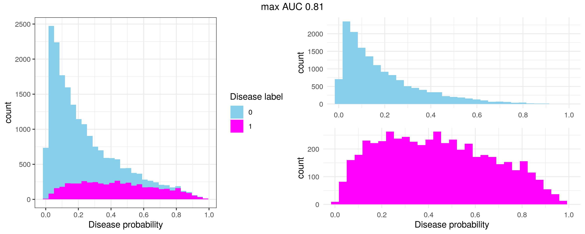
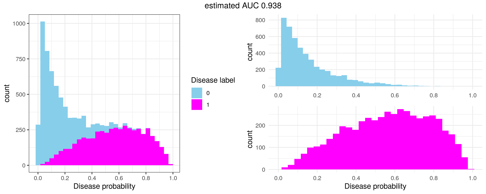
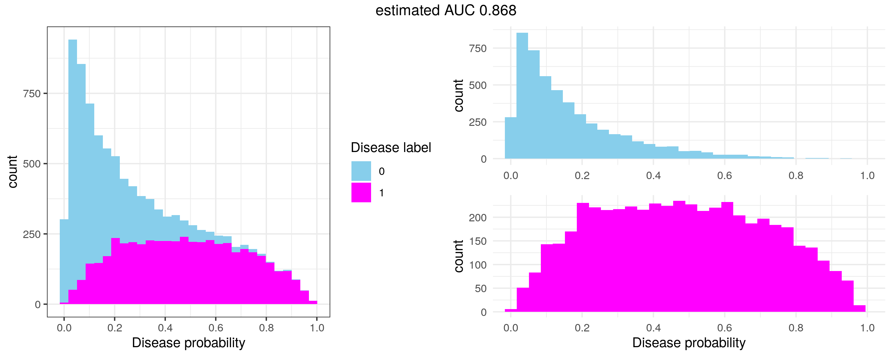
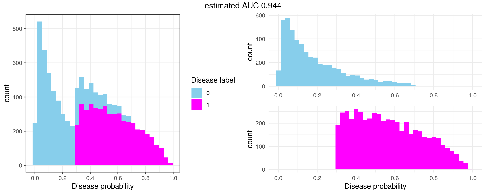
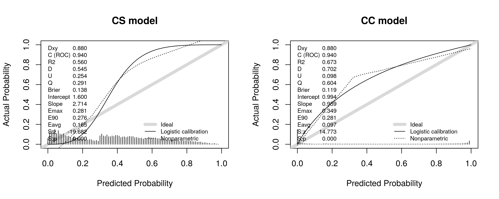
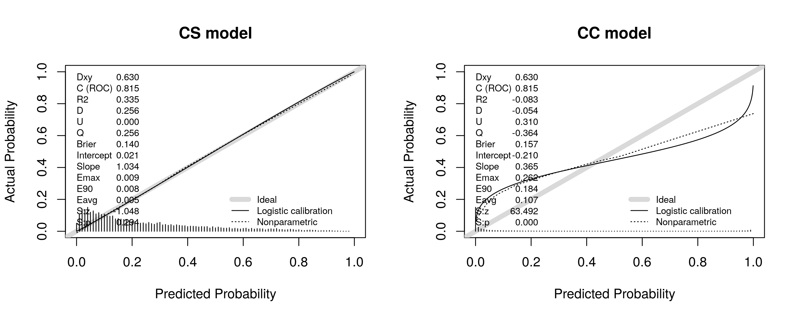

# Simulating study design effect on diagnostic models

The objective is to understand how study design, cross-sectional (CS) vs case-control (CC), may affect overfitting and performance estimation for diagnostic models. Overfitting is assessed by out-of-sample performance using a representative sample of the population (i.e. train in either CS or CC, then validate on cross-sectional sample). Performance estimation is assessed by validating models using out-sample-data that is sampled according to either CS or CC design. At the end, we will train and validate models using both CS and CC data. Finally, the ability of internal validation to estimate out-of-sample performance will also be compared between designs. We expect CC designs to lead to overfitting and overestimation of performance in both internal and external validation. The extend to which this happens is expected to be related to the severity of the bias in the design.

# Load packages


```r
library(tidyverse)
library(ggpubr)
library(rms)
theme_set(theme_bw())
source("R/functions.R")  # load helper functions
```

# Simulating the population

We will simulate a population of 1M individuals. For each individual, we simulate independent continuous traits (eg blood biomarkers), fix a set of (logistic) regression coefficients, and then use their linear combination to define the their true underlying probability of a binary outcome (e.g. having cancer). Given these probabilities, we then simulate the outcome itself.


```r
SEED <- 123456
n_pop <- 1e6
set.seed(SEED)
X <- cbind(
  1, 
  x1 = rnorm(n = n_pop, mean = 0, sd = 5),
  x2 = rnorm(n = n_pop, mean = 0, sd = 5),
  x3 = rnorm(n = n_pop, mean = 0, sd = 5)
)

beta <- c(-1.5, log(1.2), log(.8), log(1))
p <- plogis(X %*% beta)
y <- rbinom(n = n_pop, size = 1, prob = p)
df_pop <- data.frame(
  patient_id = paste0("patient-", 1:n_pop),
  y = y,
  p = p, 
  x1 = X[, 2],
  x2 = X[, 3],
  x3 = X[, 4]
)
head(df_pop)
```

```
##   patient_id y          p         x1         x2         x3
## 1  patient-1 0 0.04246440  4.1686659 10.6466646  0.8978334
## 2  patient-2 0 0.31022051 -1.3802389 -4.2688157  5.5018821
## 3  patient-3 0 0.03469222 -1.7750092  6.7324780 -3.1885464
## 4  patient-4 0 0.22813689  0.4374371 -0.9024882 -0.2998180
## 5  patient-5 1 0.46252010 11.2612787  3.1521197  6.3113035
## 6  patient-6 0 0.40592173  4.1723006 -1.6063602  1.2876122
```

We pick values such that the true prevalence of disease (or the average underlying probability) is about 25%.


```r
df_pop %>% 
  summarise(mean(y), mean(p))
```

```
##   mean(y)   mean(p)
## 1 0.24969 0.2501889
```

The coefficient vector implies that `x1` and `x2` have moderate predictor effects, while `x3` is just noise. This yields the following mean differences in the population between cases and controls (mean cases - mean controls):


```r
group_differences(df_pop)
```

```
## # A tibble: 1 × 3
##   x1_diff x2_diff x3_diff
##     <dbl>   <dbl>   <dbl>
## 1    3.43   -4.18 0.00979
```

We can plot a subset of the population to understand the distribution of disease probabilities. We also add the maximum possible discrimination in this setting (how well the cases and controls are separated by their corresponding disease probabilities):


```r
.title <- paste0(
  "max AUC ", get_auc(df_pop$y, df_pop$p)
)
plot_disease_prob(df_pop[sample(1:n_pop, 2e4),], title = .title)
```

<!-- -->

# Simulating a cross-section sample

In a diagnostic accuracy study, cross-sectional samples are needed to properly evaluate diagnostic performance. The sample is expected to be representative of the target clinical setting in which the test will be used. For diagnostic models, the idea is the same. So all we need is a random sample from out target population. We set the arbitrary sample size of `n_sample = 10000` such that we don't suffer much from sampling variability.


```r
n_sample <- 1e4
df_sample_cs <- sample_cross_sectional(df = df_pop, n = n_sample)
```

The function `sample_cross_sectional` just takes an uniformly random sample from `df` of size `n`, such that the result (`df_sample_cs`) is representative of the overall population. The result is not too surprising:


```r
.title <- paste0(
  "estimated AUC ", get_auc(df_sample_cs$y, df_sample_cs$p)
)
```

```
## Setting levels: control = 0, case = 1
```

```
## Setting direction: controls < cases
```

```r
plot_disease_prob(df = df_sample_cs, title = .title)
```

<!-- -->


# Simulating a case-control sample

There are many ways to do this. Basically, we need to sample cases and controls but not uniformly at random. Say we have a study with hospitalized cases vs healthy controls: we are comparing very sick people with people who are perfectly fine - as far as we know. This means that the likelihood of a case being selected by the study is related to of its probability of disease (conversely for controls). We over-sample on the extremes such that we don't have nearly as many people in the middle of the probability scale. This leads to biased models and performance estimates. The degree of bias depends on how we simulate the data. Here are 3 ways to do it, differing on how we define the probability of selection of cases and controls, `p`:

## Extreme: `p` is probability of corresponding label


```r
df_sample_cc <- sample_case_control(df = df_pop, n = n_sample)
.title <- paste0(
  "estimated AUC ", get_auc(df_sample_cc$y, df_sample_cc$p)
)
```

```
## Setting levels: control = 0, case = 1
```

```
## Setting direction: controls < cases
```

```r
plot_disease_prob(df = df_sample_cc, title = .title)
```

<!-- -->

This is rather extreme. From the population data, we first select `n_sample/2` cases among which we select based on the true probability of that individual having the disease. This means that cases with low disease probabilities will not be samples as often as cases with high disease probability: we are only sampling people who are clearly sick. The same reasoning serves the controls, but using the probability of being "healthy".

## Less extreme: `p` is noisy probability of label


```r
df_sample_cc2 <- sample_case_control(df = df_pop, n = n_sample, noise = 5)
.title <- paste0(
  "estimated AUC ", get_auc(df_sample_cc2$y, df_sample_cc2$p)
)
```

```
## Setting levels: control = 0, case = 1
```

```
## Setting direction: controls < cases
```

```r
plot_disease_prob(df = df_sample_cc2, title = .title)
```

<!-- -->

In this method, we take the probability of selection `p`, add some random noise as `logit(p) = logit(p) + N(0, sd^2)`, and then transform it back to probability. Here, `sd=5`. The bias is less extreme, which can be noted by the AUC that is closer to the AUC obtained with the entire population. The distributions of disease probabilities are less concentrated on the extremes - we have a better picture of intermediary patients.

## Less extreme again: set cutoffs for `p` in each group


```r
cc_cutoffs <- c(0.3, 0.7)
df_sample_cc3 <- sample_case_control(df = df_pop, n = n_sample, 
                                     cutoffs = cc_cutoffs)
.title <- paste0(
  "estimated AUC ", get_auc(df_sample_cc3$y, df_sample_cc3$p)
)
```

```
## Setting levels: control = 0, case = 1
```

```
## Setting direction: controls < cases
```

```r
plot_disease_prob(df = df_sample_cc3, title = .title)
```

<!-- -->

Here we take all cases, exclude those with probability of disease less than 15%, and then sample randomly from the ones left. We do it similarly for controls with probability of disease no larger than 85%. The rationale for this is to simulate the situation where you have a random sample from a setting (e.g. a hospital), but those patients at the hospital never go below 15% chance of disease.

We will continue with this third option as we can interpret it more directly as sampling procedure for a real study.

# Modeling

Now that we have two large samples from our population, one following a cross-sectional design (`df_sample_cs`) and another following a case-control design (`df_sample_cc3`), we can estimate logistic regression models using each of them.

## Fitting and internal validation

### Cross-sectional data

We first fit and perform internal validation with the cross-sectional sample.


```r
fit_cs <- lrm(y ~ x1 + x2 + x3, data = df_sample_cs, x = TRUE, y = TRUE)
auc_cs <- get_auc_from_fit(fit_cs)
cat("\nEstimated coeffs: ", exp(coef(fit_cs)[-1]))
```

```
## 
## Estimated coeffs:  1.197481 0.8031074 0.999629
```

```r
cat(paste0("Estimated AUC: ", auc_cs))
```

```
## Estimated AUC: 0.808596119411221
```

Notice that our estimated coefficients match almost perfectly the true values used to generate the data. Accordingly, the AUC is close to the maximum value for this population. The cross-sectional sample is representative and large enough to yield a nearly perfect model.

### Case-control data

We now fit and perform internal validation with the case-control sample. In order to get the intercept right, we need to adjust for the expected disease prevalence. We can use an offset in the model as a way to perform correction by prior modeling. This will make sure that the 1:1 sampling design doesn't hurt calibration by itself. We will use the cross-sectional data to estimate the true prevalence. Here, the `sampling_ratio` is `0.5/0.5 = 1` as we have a 1:1 design.


```r
p_hat <- mean(df_sample_cs$y)
df_sample_cc3$.offset <- get_prior_modeling_offset(p_hat = p_hat,
                                                   sampling_ratio = 0.5/0.5)
fit_cc <- lrm(y ~ x1 + x2 + x3 + offset(.offset), data = df_sample_cc3, x = TRUE, y = TRUE)
auc_cc <- get_auc_from_fit(fit_cc)
cat("\nEstimated coeffs: ", exp(coef(fit_cc)[-1]))
```

```
## 
## Estimated coeffs:  1.663114 0.5371352 1.001694
```

```r
cat(paste0("Estimated AUC: ", auc_cc))
```

```
## Estimated AUC: 0.944227076809719
```

Except for the noise predictor, the coefficients are overestimated (too extreme by a factor of about 17%), even though this is a very large sample (n = 10000). Also, the estimated AUC from the internal validation is above the maximum AUC obtained using the population data.

## External validation

Let's take other two independent samples from the population, one with each design, excluding patients that where used for model fitting. We will use these two data sets to validate both models we just built.


```r
df_val_cs <- sample_cross_sectional(
  df = df_pop %>% 
    filter(!(patient_id %in% df_sample_cs$patient_id)),
  n = 10000
)
df_val_cc <- sample_case_control(
  df = df_pop %>% 
    filter(!(patient_id %in% df_sample_cc$patient_id)),
  n = 10000,
  cutoffs = cc_cutoffs
)
```

### Case-control validation data

Let's see how the models perform in terms of discrimination.


```r
newdata <- df_val_cc
p_hat_cs <- predict(fit_cs, newdata = newdata, type = "fitted")
p_hat_cc <- predict(fit_cc, newdata = newdata, type = "fitted")
auc_cs <- get_auc(newdata$y, p_hat_cs)
```

```
## Setting levels: control = 0, case = 1
```

```
## Setting direction: controls < cases
```

```r
auc_cc <- get_auc(newdata$y, p_hat_cc)
```

```
## Setting levels: control = 0, case = 1
## Setting direction: controls < cases
```

```r
cat(
  "Estimated AUC (Case-control validation):\nCross-sectional training: ", auc_cs,
  "\nCase-control training:", auc_cc
)
```

```
## Estimated AUC (Case-control validation):
## Cross-sectional training:  0.94 
## Case-control training: 0.94
```

Both models perform equally well in terms of discrimination in the case-control validation data. Let's see how well they are calibrated.


```r
par(mfrow = c(1, 2))
cal_cs <- val.prob(y = newdata$y, p = p_hat_cs)
title(main = 'CS model')
cal_cc <- val.prob(y = newdata$y, p = p_hat_cc)
title(main = 'CC model')
```

<!-- -->

Both models are terribly miscalibrated in the case-control validation sample. This is not surprising: the case-control sample is knowingly biased, so even a perfect model - one with parameters exactly equal to the ones used to generate the data -, would be miscalibrated.

In summary, when validating with case-control data, we may expect overestimation of discrimination but poor calibration (even with arbitrarily good models).

### Cross-sectional validation data

Let's see how the models perform in terms of discrimination.


```r
newdata <- df_val_cs
p_hat_cs <- predict(fit_cs, newdata = newdata, type = "fitted")
p_hat_cc <- predict(fit_cc, newdata = newdata, type = "fitted")
auc_cs <- get_auc(newdata$y, p_hat_cs)
```

```
## Setting levels: control = 0, case = 1
```

```
## Setting direction: controls < cases
```

```r
auc_cc <- get_auc(newdata$y, p_hat_cc)
```

```
## Setting levels: control = 0, case = 1
## Setting direction: controls < cases
```

```r
cat(
  "Estimated AUC (Cross-sectional validation):\nCross-sectional training: ", auc_cs,
  "\nCase-control training:", auc_cc
)
```

```
## Estimated AUC (Cross-sectional validation):
## Cross-sectional training:  0.815 
## Case-control training: 0.815
```

Again, both models perform equally well in terms of discrimination. Let's see how well they are calibrated.


```r
par(mfrow = c(1, 2))
cal_cs <- val.prob(y = newdata$y, p = p_hat_cs)
title(main = 'CS model')
cal_cc <- val.prob(y = newdata$y, p = p_hat_cc)
title(main = 'CC model')
```

<!-- -->

The model fitted using cross-sectional data is well-calibrated, with minimum underestimation of disease probabilities on the higher end of the distribution (intercept 0.021, slope 1.034). The model fitted using case-control data, however, is severely miscalibrated (intercept -0.21, slope 0.365). In particular, its predictions are way too extreme - overestimates high probabilities and underestimates low probabilities. This is signal of overfitting, and is the result of the bias in the coefficient estimates.

